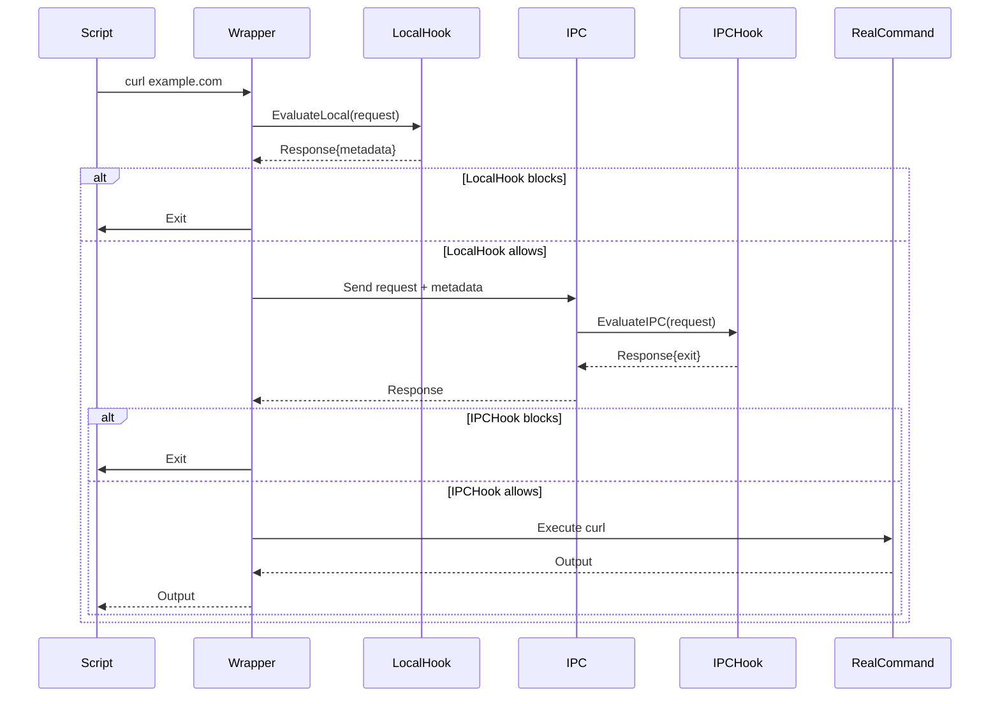

# cmdhooks

**Status: In Development**

A Go library and CLI tools for intercepting and controlling command execution during script runs. cmdhooks provides a pluggable hook system for request evaluation and can be embedded into existing Go applications.

## Features

- **Command Interception**: Interrupt and control any process launched during script execution
- **Pluggable Hook System**: Multiple hook types for different use cases
- **Interactive Approval**: Example hook to prompt users to approve/deny commands
- **Audit Logging**: Log all command executions for compliance
- **Custom Hooks**: Implement custom business logic (time restrictions, rate limiting, etc.)
- **Library**: Use as a Go library

### ⚠️ Security Disclaimer

**CmdHooks is designed for transparency and control, NOT for improving the security of untrusted scripts.**

- This tool provides visibility and control over command execution within scripts
- It should NOT be used as a security boundary against malicious code
- Malicious scripts can bypass these controls through various methods
- Use this tool for auditing, development workflow control, and transparency purposes
- Always review and validate scripts from untrusted sources before execution

## Quick Start

### Run Tests
```bash
# All tests
make test

# With coverage
make test-coverage
```

### Try Examples
The interactive example demonstrates the hook system:

```bash
# Interactive approval for commands
cd examples/interactive && ./demo.sh
```

## Hook Types

CmdHooks provides a flexible hook system with two evaluation modes:

- **LocalHook**: Fast evaluation within the wrapper process
- **IPCHook**: Centralized evaluation via inter-process communication

You can implement custom hooks using either interface for your specific use cases.

## How It Works

### Overview

CmdHooks intercepts command execution by modifying the PATH environment variable to insert wrapper scripts that get called instead of the actual commands. These wrappers evaluate the command against your configured hooks before allowing execution.

### Detailed Execution Sequence



### Key Components

#### 1. **PATH Manipulation**
```bash
# Original PATH
/usr/local/bin:/usr/bin:/bin

# Modified PATH (wrappers take precedence)
/tmp/cmdhooks-wrappers-123:/usr/local/bin:/usr/bin:/bin
```

#### 2. **Wrapper Scripts**
Each monitored command gets a wrapper script that intercepts execution:
```bash
#!/usr/bin/env bash
# Wrapper at /tmp/cmdhooks-wrappers-123/curl
exec "/path/to/cmdhooks" run curl "$@"
```

#### 3. **Hook Evaluation**
- **LocalHook**: Fast, runs in wrapper process, no network overhead
- **IPCHook**: Centralized policy enforcement, runs in main process

#### 4. **IPC Protocol**
Communication between wrapper and interceptor uses JSON over Unix sockets:

**Request:**
```json
{
  "command": ["curl", "https://example.com"],
  "pid": 12345,
  "hook": "pre_run",
  "metadata": {
    "local_check": "passed"
  }
}
```

**Response:**
```json
{
  "exit": false,
  "metadata": {}
}
```

## Library Usage

```go
import (
    "context"
    "github.com/codysoyland/cmdhooks/pkg/cmdhooks"
    "github.com/codysoyland/cmdhooks/pkg/hook"
)

// Implement a custom hook
type MyHook struct{}

func (h *MyHook) Name() string { return "my-hook" }
func (h *MyHook) Commands() []string { return []string{"curl", "wget"} }
func (h *MyHook) EvaluateLocal(ctx context.Context, req *hook.Request) (*hook.Response, error) {
    // Your evaluation logic here
    return &hook.Response{}, nil // Continue execution
}

func main() {
    // Create CmdHooks instance
    ch, err := cmdhooks.New(
        cmdhooks.WithHook(&MyHook{}),
        cmdhooks.WithVerbose(true),
        // Optional: tune IPC evaluation timeout
        cmdhooks.WithInterceptorTimeout(30*time.Second),
    )
    if err != nil {
        panic(err)
    }
    defer ch.Close()

    // Execute script with command interception
    err = ch.Execute([]string{"bash", "-c", "curl https://example.com"})
    if err != nil {
        panic(err)
    }
}

### Configurable Timeouts

- Library option:
  - `cmdhooks.WithInterceptorTimeout(d time.Duration)`: bounds IPC evaluation inside the interceptor (default 10m).
```

## Development

See [CLAUDE.md](CLAUDE.md) for detailed development guidelines and architecture documentation.

## License

MIT License - see [LICENSE](LICENSE) file for details.
